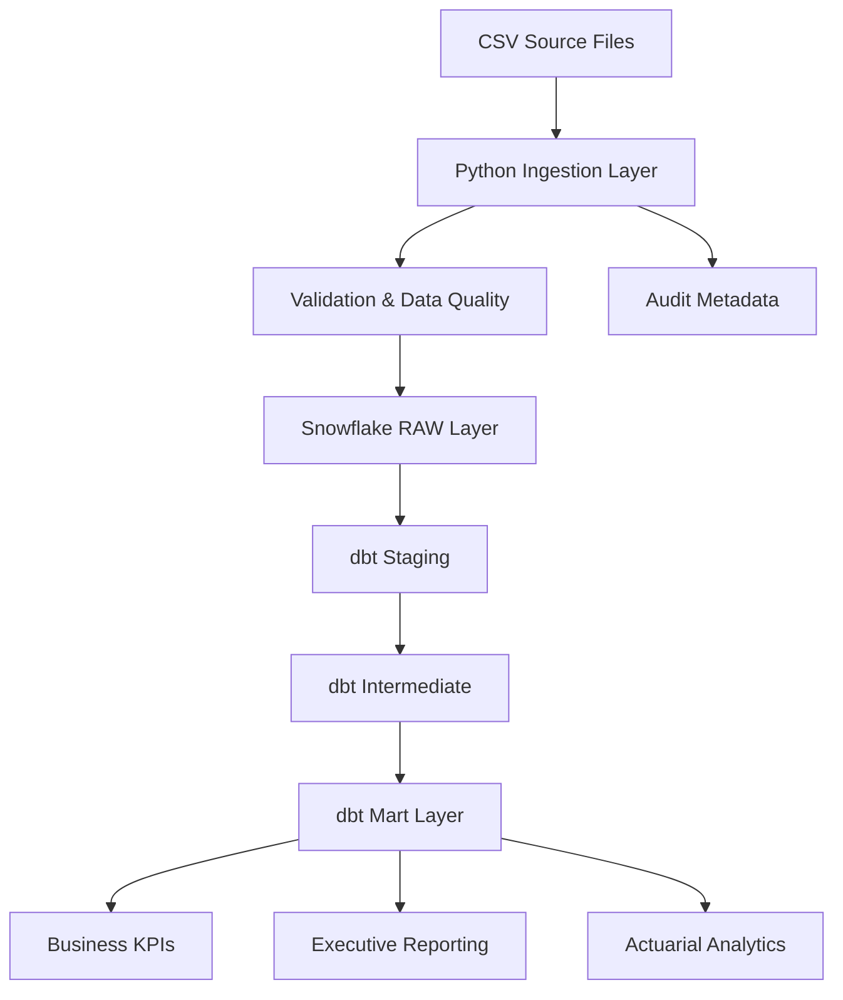

# Insurance Analytics ELT Platform

End-to-end insurance analytics ELT platform using Python, Snowflake, SQL, and dbt featuring:

- Idempotent ingestion
- Append-only RAW architecture
- Data quality validation
- Incremental transformations
- Latest-state deduplication
- KPI marts for actuarial analytics

---

# Architecture



---

# Tech Stack

- Python
- Snowflake
- SQL
- dbt
- GitHub Actions (planned)
- Power BI/Tableau (planned)

---

# Key Features

## Python Ingestion Layer
- Schema validation
- Rejected-record handling
- Audit metadata
- Batch tracking

## Snowflake RAW Layer
- Append-only ingestion
- Immutable raw records
- Replayable ingestion

## dbt Transformation Layer
- Staging models
- Intermediate reusable logic
- Latest-state deduplication
- Incremental marts

## KPI Marts
- Claim approval rate
- Rejection rate
- Daily claims trend
- Customer segmentation
- Policy-level analytics

---

# Project Structure

```text
insurance-analytics-elt-platform/
├── data/
├── ingestion/
├── sql/
├── dbt_project/
├── diagrams/
├── README.md
```
```text
Airflow was added as an orchestration layer to schedule and monitor the ELT workflow. The DAG runs Python ingestion first, then executes dbt transformations, then runs dbt tests. This ensures downstream analytics models only run after validated data is loaded successfully.
```

