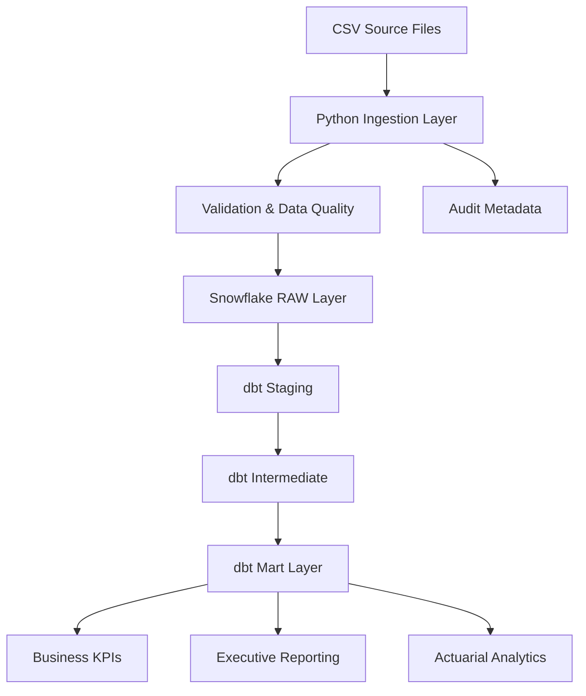

```mermaid
flowchart TD

A[CSV Source Files]
--> B[Python Ingestion Layer]

B --> C[Validation & Data Quality]
B --> D[Audit Metadata]

C --> E[Snowflake RAW Layer]

E --> F[dbt Staging]
F --> G[dbt Intermediate]
G --> H[dbt Mart Layer]

H --> I[Business KPIs]
H --> J[Executive Reporting]
H --> K[Actuarial Analytics]
```